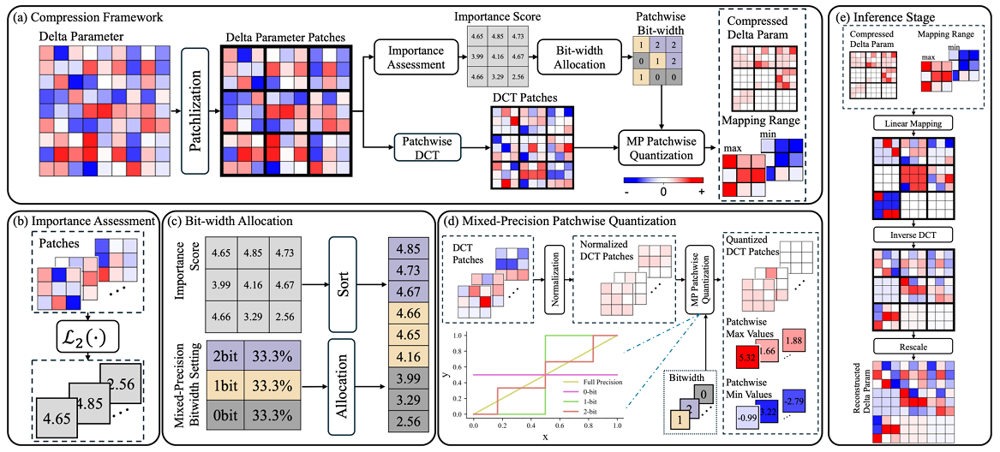








Hi! I am **Xiaohui Wang**, a final-year undergraduate student majoring in Electronic Information Science and Technology at [Fudan University](https://www.fudan.edu.cn). I am fortunate to be advised by [Prof. Tao Chen](https://eetchen.github.io/) at the Fudan EDL Lab. I also work closely with Dr. Peng Ye (Postdoc at [MMLab@CUHK](https://mmlab.ie.cuhk.edu.hk). My research interests lie in **Efficient AI** and **Embodied AI**.

I am proud to have received the **National Scholarship twice (2022–2023, 2024–2025)** for my academic achievements. I am passionate about exploring ways to enhance AI systems for more efficient and versatile real-world applications.

I have worked as a **research intern** at [MMLab@HKU](https://mmlab.hk) under the supervision of [Prof. Ping Luo](http://luoping.me/). I am excited to work alongside talented researchers.

In addition, I am a member of the [EGA robotics team](https://drive.google.com/file/d/18Pnz-0MFsJgAAWyQN3Yqpy9VvCE-_q71/view?usp=drive_link) at Fudan University, representing the university in the **RoboMaster** competition.

In Fall 2026, I will be joining [The Hong Kong University of Science and Technology (HKUST)](https://hkust.edu.hk/) as a Ph.D. student.

If you are interested in connecting, collaborating, or discussing ideas, feel free to reach out to me via email. You can also access my CV [**HERE**](https://drive.google.com/file/d/187rZdZZIrTxQpYSrKbO4YIWrrETO6eEs/view?usp=drive_link).

# 🔥 News
- *2025.10*: &nbsp;🎉🎉 I have received my second National Scholarship. Many thanks for the recognition!
- *2025.09*: &nbsp;🎉🎉 Our work [UltraDelta](https://arxiv.org/pdf/2505.13563) has been accepted as a poster at **NeurIPS 2025**！
- *2025.05*: &nbsp;🎉🎉 I am proud to be named one of the Top 10 Students in the School of Information Science and Technology!
- *2025.05*: &nbsp;🎉🎉 I have received the Fumei Summer Research Scholarship. Many thanks to the Fumei Foundation!
- *2023.12*: &nbsp;🎉🎉 I have received the National Scholarship. Many thanks for the recognition!

# 🎖 Honors and Awards
- *2024-2025* **National Scholarship**
- *2022-2023* **National Scholarship**
- *2024-2025* Top 10 Student Award at School of Information Science and Technology
- *2025.05* Fumei Summer Research Scholarship (awarded to only 4 students at Fudan University)
- *2023-2024* SCSK Corporation Scholarship
- *2024.09* China Undergraduate Mathematical Contest in Modeling (Second Prize, Shanghai)

# 📝 Publications

NeurIPS

[Breaking the Compression Ceiling: Data-Free Pipeline for Ultra-Efficient Delta Compression](https://arxiv.org/pdf/2505.13563)

**Xiaohui Wang**\*, Peng Ye\*, Chenyu Huang, Shenghe Zheng, Bo Zhang, Lei Bai, Wanli Ouyang, Tao Chen&#8224;

(Accepted by NeurIPS 2025)

- To break the compression ceiling of delta weights, we analyze the limitations of existing methods in information preservation and model stability, and propose UltraDelta, the first data-free pipeline enabling ultra-efficient delta compression, achieving both ultra-high compression ratios and strong performance without relying on any data.

arxiv

[Seeing Delta Parameters as JPEG Images: Data-Free Delta Compression with Discrete Cosine Transform](https://arxiv.org/pdf/2503.06676)

Chenyu Huang\*, Peng Ye\*, **Xiaohui Wang**, Shenghe Zheng, Biqing Qi, Lei Bai, Wanli Ouyang, Tao Chen&#8224;

- Motivated by the classic JPEG compression, we explore the delta compression from the DCT domain for the first time. We first realize data-free delta compression and further reduce the performance degradation. We propose a framework based on compression in the DCT domain, named DELTA-DCT.

# 📖 Education
- *2022.06 - present*, Electronic Information Science and Technology, Fudan University. (GPA:93/100, rank: 5/95 in class, 5/206 in school)
- *2025.06 - 2025.09*, School of Computing and Data Science, The University of Hong Kong (Summer Intern at MMLab@HKU)

<!-- # 💬 Invited Talks
- *2021.06*, Lorem ipsum dolor sit amet, consectetur adipiscing elit. Vivamus ornare aliquet ipsum, ac tempus justo dapibus sit amet.
- *2021.03*, Lorem ipsum dolor sit amet, consectetur adipiscing elit. Vivamus ornare aliquet ipsum, ac tempus justo dapibus sit amet.  \| [\[video\]](https://github.com/)

# 💻 Internships
- *2019.05 - 2020.02*, [Lorem](https://github.com/), China. -->

---

<em>Last update in October 2025</em>

