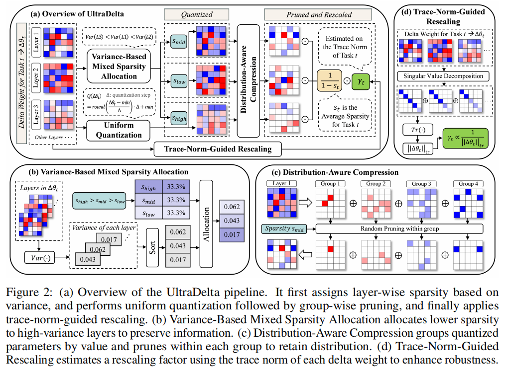








Hi! I am **Xiaohui Wang**, an incoming Ph.D. student at [The Hong Kong University of Science and Technology (HKUST)](https://hkust.edu.hk/), where I will be advised by [Prof. Ping Tan](https://pingtan.people.ust.hk/index.html) starting in Fall 2026. I recently received my bachelor's degree from [Fudan University](https://www.fudan.edu.cn), where I was fortunate to be advised by [Prof. Tao Chen](https://eetchen.github.io/) at the Fudan EDL Lab.

I am currently an intern at **TARS Robotics**, where I work with [Prof. Wenchao Ding](https://wenchaoding.github.io/personal/index.html). Previously, I worked as a **research intern** at **MMLab@HKU** under the supervision of [Prof. Ping Luo](http://luoping.me/). I also collaborate closely with [Dr. Peng Ye](https://scholar.google.com/citations?user=UEZZP5QAAAAJ&hl=en) at **MMLab@CUHK**.

My research interests lie in **Efficient AI** and **Embodied AI**.

During my undergraduate studies, I was a member of the [EGA Robotics Team](https://drive.google.com/file/d/18Pnz-0MFsJgAAWyQN3Yqpy9VvCE-_q71/view?usp=drive_link), representing Fudan University in the **RoboMaster** competition.

If you are interested in connecting, collaborating, or discussing ideas, feel free to reach out to me at [heatherwang000@gmail.com](mailto:heatherwang000@gmail.com).

# 🔥 News
- *2026.04*: &nbsp;🎉🎉 Our work [Rhythm](https://hoshi-no-ai.github.io/Rhythm/) has been accepted at **RSS 2026**!
- *2026.04*: &nbsp;🎉🎉 I have received the Hong Kong PhD Fellowship (HKPFS). Many thanks for the recognition!
- *2025.10*: &nbsp;🎉🎉 I have received my second National Scholarship. Many thanks for the recognition!
- *2025.09*: &nbsp;🎉🎉 Our work [UltraDelta](https://arxiv.org/pdf/2505.13563) has been accepted at **NeurIPS 2025**!
- *2025.05*: &nbsp;🎉🎉 I have received the Fumei Summer Research Scholarship. Many thanks to the Fumei Foundation!
- *2023.12*: &nbsp;🎉🎉 I have received the National Scholarship. Many thanks for the recognition!

# 🎖 Honors and Awards
- *2026.04* **Hong Kong PhD Fellowship (HKPFS)**
- *2024-2025* **National Scholarship**
- *2022-2023* **National Scholarship**
- *2026.04* **Shanghai Outstanding Graduate**
- *2024-2025* Top 10 Student Award at School of Information Science and Technology
- *2025.05* Fumei Summer Research Scholarship (awarded to only 4 students at Fudan University)
- *2023-2024* SCSK Corporation Scholarship

# 📝 Publications

NeurIPS

[Breaking the Compression Ceiling: Data-Free Pipeline for Ultra-Efficient Delta Compression](https://arxiv.org/pdf/2505.13563)

**Xiaohui Wang**\*, Peng Ye\*, Chenyu Huang, Shenghe Zheng, Bo Zhang, Lei Bai, Wanli Ouyang, Tao Chen&#8224;

(Accepted by NeurIPS 2025)

# 📖 Experience
- *2026.01 - 2026.07*, **Intern, TARS Robotics**.
- *2022.06 - 2026.06*, **Undergraduate, Fudan University**.
- *2025.06 - 2025.09*, **Summer Intern, MMLab@HKU, The University of Hong Kong**.

<!-- # 💬 Invited Talks
- *2021.06*, Lorem ipsum dolor sit amet, consectetur adipiscing elit. Vivamus ornare aliquet ipsum, ac tempus justo dapibus sit amet.
- *2021.03*, Lorem ipsum dolor sit amet, consectetur adipiscing elit. Vivamus ornare aliquet ipsum, ac tempus justo dapibus sit amet.  \| [\[video\]](https://github.com/)

# 💻 Internships
- *2019.05 - 2020.02*, [Lorem](https://github.com/), China. -->

---

<em>Last update in July 2026</em>

