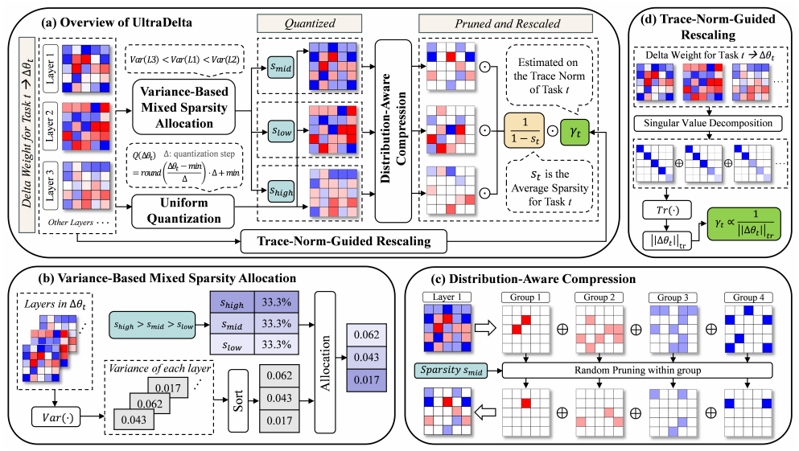








Hi! I am **Xiaohui Wang**, a third-year undergraduate student majoring in Electronic Information Science and Technology at [Fudan University](https://www.fudan.edu.cn). I am fortunate to be advised by [Prof. Tao Chen](https://eetchen.github.io/) at the Fudan EDL Lab. I also work closely with [Dr. Peng Ye](https://scholar.google.com/citations?user=UEZZP5QAAAAJ&hl=zh-CN) (Postdoc at CUHK MMLab). My research interests lie in **Efficient AI**, **Multi-Modal AI**, and **Multi-Agent Systems**.

I am proud to have received the **National Scholarship (2022-2023)** for my academic achievements, with a GPA of **92/100**. I am passionate about exploring ways to enhance AI systems for more efficient and versatile real-world applications.

This summer, I will be joining HKU [MMLab](https://mmlab.ie.cuhk.edu.hk) as a **research intern** under the supervision of [Prof. Ping Luo](http://luoping.me/). I am excited to work alongside talented researchers.

If you are interested in connecting, collaborating, or discussing ideas, feel free to reach out to me via email. I am also seeking a Ph.D. position for Fall 2026. You can access my CV [**HERE**](https://drive.google.com/file/d/187rZdZZIrTxQpYSrKbO4YIWrrETO6eEs/view?usp=drive_link).

# 🔥 News
- *2025.05*: &nbsp;🎉🎉 Our work [UltraDelta](https://arxiv.org/pdf/2503.06676) is now on arxiv！
- *2025.05*: &nbsp;🎉🎉 I am proud to be named one of the Top 10 Students in the School of Information Science and Technology!
- *2025.05*: &nbsp;🎉🎉 I have received the Fumei Summer Research Scholarship. Many thanks to the Fumei Foundation!
- *2025.03*: &nbsp;🎉🎉 I have been accepted into the 2025 Summer Research Internship Programme in School of CDS at HKU.
- *2025.03*: &nbsp;🎉🎉 Our work [Delta-DCT](https://arxiv.org/pdf/2503.06676) is now on arxiv！

# 🎖 Honors and Awards
- *2022-2023* **National Scholarship**
- *2024-2025* Top 10 Student Award at School of Information Science and Technology
- *2025.05* Fumei Summer Research Scholarship (awarded to only 4 students at Fudan University)
- *2023-2024* SCSK Corporation Scholarship
- *2024.09* China Undergraduate Mathematical Contest in Modeling (Second Prize, Shanghai)

# 📝 Selected Publications

arxiv

[Breaking the Compression Ceiling: Data-Free Pipeline for Ultra-Efficient Delta Compression](https://arxiv.org/pdf/2503.06676)

**Xiaohui Wang**\*, Peng Ye\*, Chenyu Huang, Shenghe Zheng, Bo Zhang, Lei Bai, Wanli Ouyang, Tao Chen&#8224;

- To break the compression ceiling of delta weights, we propose UltraDelta, the first data-free pipeline enabling ultra-efficient delta compression, achieving both ultra-high compression ratios and strong performance without relying on any data.

arxiv

[Seeing Delta Parameters as JPEG Images: Data-Free Delta Compression with Discrete Cosine Transform](https://arxiv.org/pdf/2503.06676)

Chenyu Huang\*, Peng Ye\*, **Xiaohui Wang**, Shenghe Zheng, Biqing Qi, Lei Bai, Wanli Ouyang, Tao Chen&#8224;

- Motivated by the classic JPEG compression, we explore the delta compression from the DCT domain for the first time. We first realize data-free delta compression and further reduce the performance degradation. We propose a framework based on compression in the DCT domain, named DELTA-DCT.

# 📖 Education
- *2022.06 - present*, Electronic Information Science and Technology, Fudan University. (GPA:92/100, rank: 5/95 in class, 9/295 in school)

<!-- # 💬 Invited Talks
- *2021.06*, Lorem ipsum dolor sit amet, consectetur adipiscing elit. Vivamus ornare aliquet ipsum, ac tempus justo dapibus sit amet.
- *2021.03*, Lorem ipsum dolor sit amet, consectetur adipiscing elit. Vivamus ornare aliquet ipsum, ac tempus justo dapibus sit amet.  \| [\[video\]](https://github.com/)

# 💻 Internships
- *2019.05 - 2020.02*, [Lorem](https://github.com/), China. -->

---

<em>Last update in May 2025</em>

